# UX 设计法则

> 来源：[lawsofux.com](https://lawsofux.com/) 作者：Jon Yablonski
> 
> 这是一个收集了用户体验设计最佳实践的网站，帮助设计师构建更易用的用户界面。

---

## 概述

UX 设计法则源自心理学、人机交互和认知科学等领域，是设计师在构建用户界面时可以考虑的最佳实践总结。

---

## 心理学法则

### 认知偏差

人们在进行判断时会产生系统性的思维错误，这种错误会影响我们对世界的感知和决策能力。

**实际例子**

| 错误的认知模式 | 设计师的应对方式 |
|---------------|-----------------|
| 锚定偏差：看到原价后再看折后价会觉得便宜 | 在设计中设置合适的参照物 |
| 确认偏差：只关注支持自己观点的信息 | 展示多元化数据，避免引导性设计 |
| 可用性偏差：认为容易想到的就是常见的 | 不要依赖直觉，多做用户调研 |

**设计应用**
- 了解用户常见的认知偏差
- 设计时考虑如何规避负面认知偏差影响
- 利用认知偏差改善用户体验

---

### 认知负荷

用户理解和操作界面时需要消耗的脑力资源的数量。

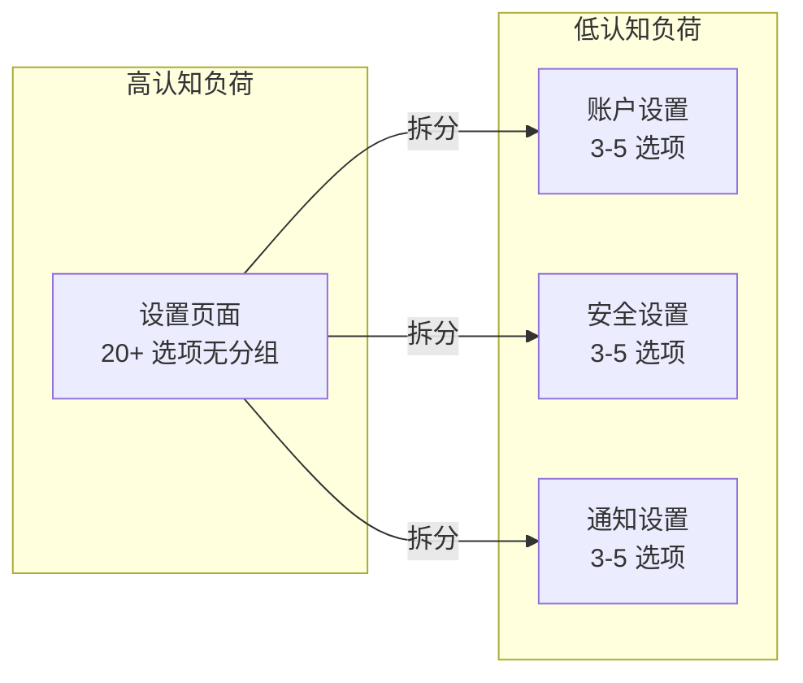

**实际例子**

```
❌ 高认知负荷：一个设置页面包含 20+ 个选项，没有分组
✅ 低认知负荷：设置按功能分组（账户、安全、通知），每个分组 3-5 个选项
```

**设计应用**
- 减少用户的认知负担
- 将信息分块呈现
- 使用用户熟悉的 UI 模式降低学习成本

---

### 心流

一种心理状态，人们在进行某种活动时完全沉浸其中，感到专注、投入和愉悦。

**实际例子**

| 让人进入心流的设计 | 破坏心流的设计 |
|------------------|--------------|
| 游戏中的进度条显示还差多少升级 | 突然弹出客服对话框 |
| 视频编辑软件的实时预览 | 保存文件时卡住 30 秒 |
| 打字时无延迟的字符显示 | 输入文字后等 2 秒才出现 |

**设计应用**
- 提供即时反馈
- 保持界面简洁，减少干扰
- 设置适当的挑战和明确的目标

---

### 心智模型

用户基于自己对系统及其工作方式的认知而形成的内在理解。

**实际例子**

```
用户看到这些图标时的理解：
┌─────────────┐    ┌─────────────┐    ┌─────────────┐
│    📁       │    │    🗑️       │    │    🛒       │
│   文件夹     │    │    垃圾桶    │    │    购物车    │
├─────────────┤    ├─────────────┤    ├─────────────┤
│ 存储文件的地方 │    │  删除文件的地方 │    │ 结算前暂存区  │
│ 即使在云端    │    │  手机上是移到  │    │ 不是真正的   │
│             │    │  "最近删除"   │    │  购物车      │
└─────────────┘    └─────────────┘    └─────────────┘
```

**设计应用**
- 使用用户熟悉的概念和隐喻
- 保持界面与用户心智模型一致
- 通过可视化帮助用户理解系统

---

### 米勒定律

普通人只能在工作记忆中保留 7（±2）个信息项目。

```mermaid
graph TD
    subgraph 工作记忆 "7±2 个槽位"
        M1["1"]
        M2["2"]
        M3["3"]
        M4["4"]
        M5["5"]
        M6["6"]
        M7["7"]
        M8["..."]
    end
    
    subgraph 分组记忆
        G1["家人 👨‍👩‍👧<br/>3人"]
        G2["朋友 👯<br/>5人"]
        G3["同事 💼<br/>4人"]
    end
    
    M1 -.->|每组项数少| G1
    M2 -.-> G2
    M3 -.-> G3
```

**实际例子**

```
❌ 超出记忆容量：手机通讯录按拼音顺序列出 500 个联系人
✅ 符合记忆容量：通讯录支持按"家人"、"朋友"、"同事"分组，每组 5-10 人
```

**设计应用**
- 将大量内容分成小块（5-9 项）
- 使用分组和分类组织信息
- 避免一次性呈现过多选项

---

### 选择性注意

人们倾向于只关注环境中与当前目标相关的刺激，忽略其他信息。

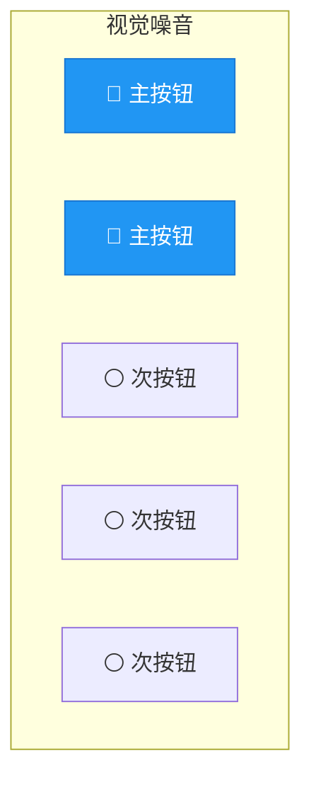

**实际例子**

```
❌ 视觉噪音：页面上有 5 个按钮都很醒目，用户不知道点哪个
✅ 视觉层次：主按钮用实心蓝色，次按钮用线框灰色，用户自然聚焦主按钮
```

**设计应用**
- 使用视觉层次突出重要元素
- 通过对比和颜色吸引注意力
- 避免过多视觉噪音干扰用户

---

## 感知与视觉法则

### 审美-可用性效应

用户通常认为美观的设计比不美观的设计更好用，即使两者功能相同。

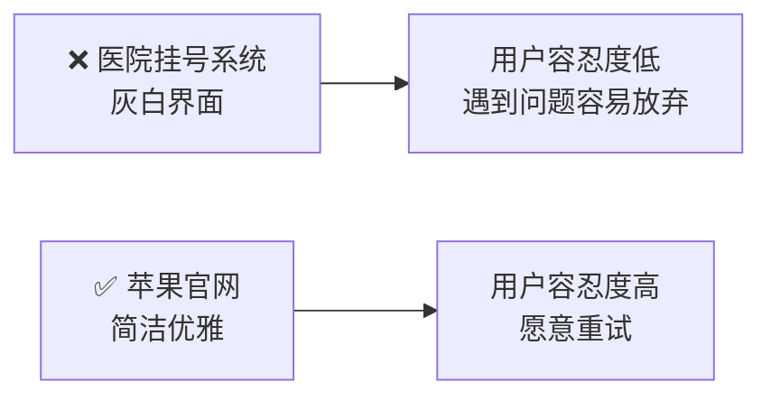

**实际例子**

| 不美观的界面 | 美观的界面 |
|-------------|-----------|
| 医院挂号系统的灰白界面 | 苹果官网的简洁优雅设计 |
| 银行老旧的后台系统 | 现代金融 App 的精致 UI |
| 用户容忍度低，遇到问题容易放弃 | 用户容忍度高，愿意重试 |

**设计应用**
- 投资于界面美学设计
- 美观的设计可以增加用户容忍度
- 保持视觉一致性和专业感

---

### 选择过载

当用户面对大量选项时往往会感到不知所措，这被称为"选择悖论"。

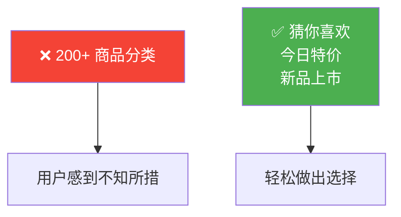

**实际例子**

```
❌ 电商首页显示 200+ 个商品分类
✅ 电商首页只显示"猜你喜欢"、"今日特价"、"新品上市"，其余归入"全部商品"展开查看
```

**设计应用**
- 限制用户必须做出的选择数量
- 提供智能默认值
- 使用渐进式披露避免信息过载

---

### 分块

将大量信息分解为小组，并将其有意义地组织为整体的过程。

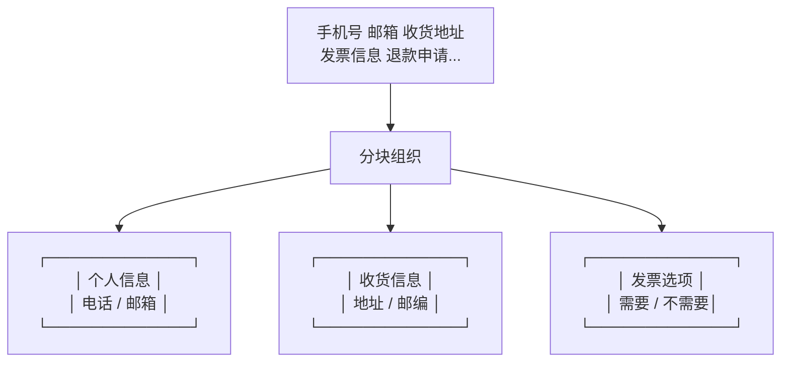

**设计应用**
- 将大量数据分成易于管理的小组
- 使用视觉分组和间距区分内容
- 创建清晰的层次结构

---

### 共同区域定律

如果元素共享具有明确边界的区域，则用户倾向于将它们感知为一组。

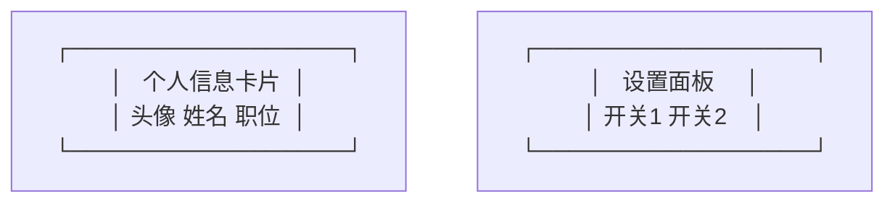

**设计应用**
- 使用边框和背景区分内容组
- 创建明确的卡片和面板
- 使用容器组织相关信息

---

### 接近定律

靠近或相邻的元素倾向于被用户归为一组。

```mermaid
graph LR
    subgraph 错误示例
        A1["名称"] A2["[输入框]"] A3["电话"] A4["[输入框]"] A5["地址"] A6["[输入框]"]
    end
    
    subgraph 正确示例
        B1["名称"] B2["[输入框]"]
        B3["电话"] B4["[输入框]"]
        B5["地址"] B6["[输入框]"]
    end
```

**设计应用**
- 相关元素靠近放置
- 不相关元素保持距离
- 使用间距创建视觉关系

---

### 简洁定律

人们倾向于将模糊或复杂的图像感知为尽可能简单的形式，因为简单的解释需要最少的认知努力。

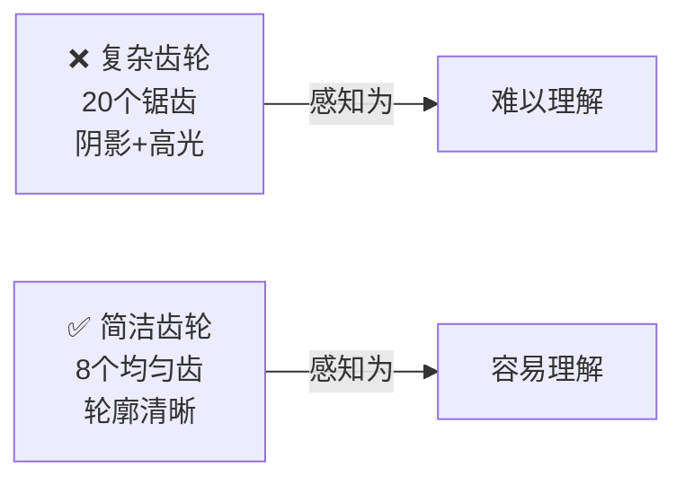

**设计应用**
- 保持 UI 简洁
- 使用简单形状和清晰轮廓
- 避免不必要的复杂性

---

### 相似定律

人眼倾向于将相似元素感知为完整的图片、形状或组，即使这些元素是分开的。

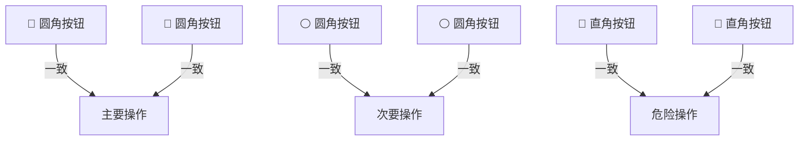

**设计应用**
- 使用一致的样式表示相关元素
- 视觉上区分不同类型的元素
- 保持相关按钮和链接的样式统一

---

### 均匀连接定律

视觉上连接的元素被认为比没有连接的元素更相关。

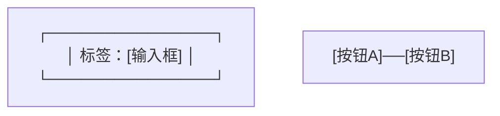

**设计应用**
- 使用线条或边框连接相关元素
- 通过下划线或背景连接标签和输入框
- 创建清晰的导航路径

---

## 交互与性能法则

### 多赫蒂阈值

当计算机与用户的交互响应时间 < 400 毫秒时，生产率会大幅提升。

```mermaid
gantt
    title 响应时间与用户感受
    dateFormat X
    axisFormat %s ms
    
    section 体验
    <100ms        :done, 0, 100
    100-400ms     :done, 100, 400
    400-1000ms    :active, 400, 1000
    >1000ms       :crit, 1000, 2000
    
    感觉很棒     :milestone, 100, 0
    可接受       :milestone, 400, 0
    开始分心     :milestone, 1000, 0
```

| 响应时间 | 用户感受 |
|---------|---------|
| < 100ms | 几乎感觉不到延迟 |
| 100-400ms | 轻微等待，可接受 |
| 400-1000ms | 明显等待，开始分心 |
| > 1s | 焦虑，需要加载提示 |

**设计应用**
- 确保核心交互响应时间 < 400ms
- 提供即时反馈和加载状态
- 使用乐观更新减少等待感知

---

### 菲茨定律

获取目标的时间取决于到目标的距离和目标的大小。

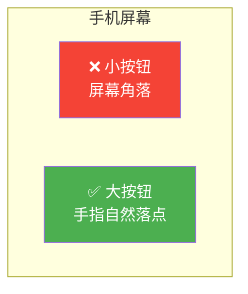

**实际例子**

```
❌ 差的设计：删除按钮放在屏幕左上角小角落
✅ 好的设计：大按钮放在手指自然落点位置（手机屏幕下半部分）
```

**设计应用**
- 将重要按钮放置在手指易于点击的位置
- 增大可点击目标的大小（至少 44x44 像素）
- 减小导航距离

---

### 波斯特尔定律

对自己接受的要宽松，对自己发送的要保守。

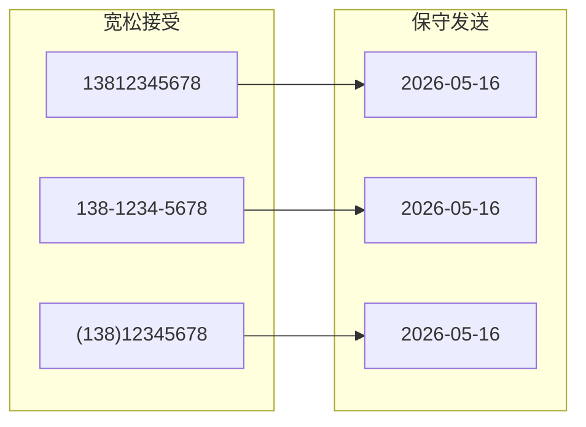

**设计应用**
- 接受用户输入的各种格式
- 提供明确的输入指导
- 优雅地处理错误和边界情况

---

### 特斯拉定律

每个应用程序都有固有的复杂性，无法完全移除或隐藏，只能转移。

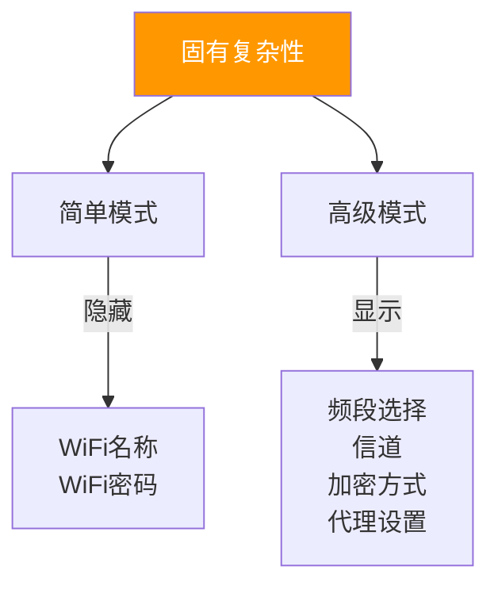

**设计应用**
- 接受某些复杂性是必要的
- 将复杂性隐藏在高级选项中
- 让用户选择他们想要的复杂性级别

---

## 决策与选择法则

### 希克定律

做出决定的时间随着选择的数量和复杂性增加而增加。

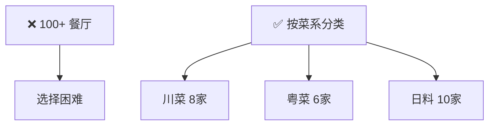

**设计应用**
- 减少选项数量
- 使用渐进式表单分步收集信息
- 提供清晰分类和筛选功能

---

### 帕累托原则

对于许多事件，大约 80% 的影响来自 20% 的原因。


**实际例子**

```
一个新闻 App：
- 80% 的用户只使用 20% 的功能：浏览、搜索、收藏
- 其他 80% 的功能（评论、分享、设置）只有 20% 的用户使用

→ 应该优先优化这 20% 的核心功能体验
```

**设计应用**
- 识别并优先处理最常用的 20% 功能
- 优化产生最大影响的用户路径
- 使用数据分析确定功能优先级

---

### 峰终定律

用户主要根据体验过程中的"峰值"和"结束"时的感受来评判整个体验。

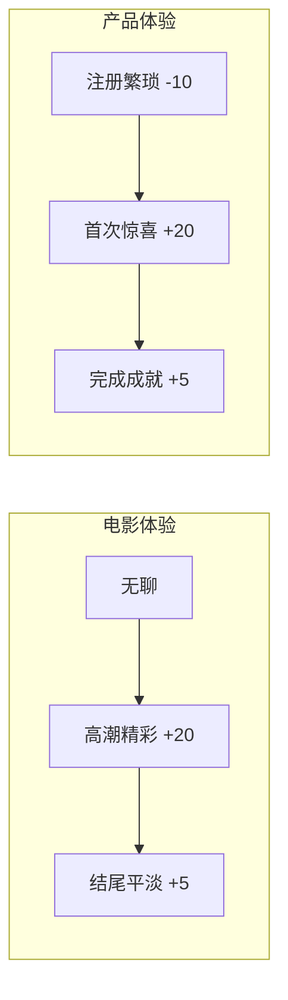

**设计应用**
- 设计令人难忘的"峰值"时刻（如首次使用的引导）
- 确保结束体验是积极的（如完成任务后的感谢页面）
- 优化用户旅程中最关键的环节

---

### 序列位置效应

用户最容易记住系列中的第一个和最后一个项目。

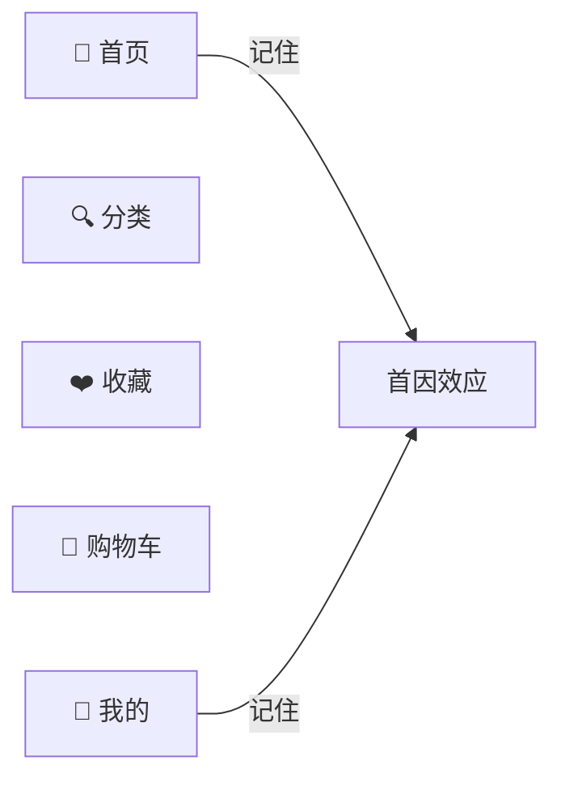

**实际例子**

```
App 底部导航顺序：
[首页] [分类] [购物车] [我的]

用户最记得：首页（第一个）和我的（最后一个）
→ 最重要和最常用的功能放首位和末位
```

**设计应用**
- 将最重要的项目放在开头或结尾
- 在列表中间放置最不重要的项目
- 使用折行或分页重新定义序列

---

## 用户行为法则

### 雅各布定律

用户大部分时间花在其他网站上，因此希望你的网站以他们已经熟悉的方式工作。


**设计应用**
- 遵循平台设计规范（iOS 人机界面指南、Material Design）
- 使用用户熟悉的 UI 模式
- 避免不必要的创新，核心交互保持一致

---

### 目标梯度效应

接近目标的倾向随着与目标的距离减少而增加。

```mermaid
graph LR
    P1["████████░░ 80%"] -->|"越接近<br/>越有动力| G["🎯 升级！"]
    
    P2["已连续签到 29 天"] -->|"最后一天<br/>不愿放弃| G2["30天成就"]
```

**实际例子**

```
游戏升级进度条：
████████████░░░░ 80%
还差 500 经验值升级！

→ 越接近目标越有动力继续
```

**设计应用**
- 显示进度条鼓励用户完成目标
- 早期给予奖励保持用户动力
- 突出显示已完成步骤

---

### 活跃用户悖论

用户从不阅读手册，而是立即开始使用软件。

```mermaid
graph TD
    A["❌ 5000字使用指南"] --> B["0.1% 用户阅读"]
    C["✅ 3秒引导提示"] --> D["80% 用户看到"]
    
    style A fill:#f44336,color:#fff
    style C fill:#4CAF50,color:#fff
```

**设计应用**
- 设计直观的界面，让用户无需阅读文档就能使用
- 提供上下文帮助（在需要时显示提示）
- 使用渐进式引导，而非提前展示所有功能

---

## 时间管理法则

### 帕金森定律

任何任务都会膨胀，直到耗尽所有可用时间。

```mermaid
graph LR
    T1["3天截止"] --> R1["✅ 按时完成"]
    T2["1周截止"] --> R2["⏰ 1周完成"]
```

**设计应用**
- 设置明确的项目截止日期
- 限制功能范围（Feature Freeze）
- 使用时间盒方法管理开发和设计冲刺

---

### 奥卡姆剃刀

在预测效果相同的竞争假设中，应选择假设最少的一个。

```mermaid
graph TD
    A["Elasticsearch<br/>机器学习排序<br/>个性化推荐"]
    B["LIKE 查询<br/>简单相关性排序"]
    
    A -.->|"方案A<br/>过于复杂"| X
    B -.->|"方案B<br/>简单有效"| X
```

**设计应用**
- 优先选择最简单的解决方案
- 避免过度工程化
- 消除不必要的复杂性

---

## 法则分类速查

### 认知心理学
- 认知偏差
- 认知负荷
- 心流
- 心智模型
- 米勒定律
- 选择性注意

### 感知与视觉
- 共同区域定律
- 接近定律
- 简洁定律
- 相似定律
- 均匀连接定律

### 交互与性能
- 多赫蒂阈值
- 菲茨定律
- 波斯特尔定律
- 特斯拉定律

### 决策与选择
- 选择过载
- 希克定律
- 帕累托原则
- 峰终定律
- 序列位置效应

### 用户行为
- 审美-可用性效应
- 目标梯度效应
- 雅各布定律
- 活跃用户悖论

### 时间管理
- 帕金森定律
- 奥卡姆剃刀

---

## 参考资料

- [Laws of UX 官网](https://lawsofux.com/)
- [Jon Yablonski](https://jonyablonski.com/)
- [Laws of UX 电子书](https://www.oreilly.com/library/view/laws-of-ux/9781492055303/)
